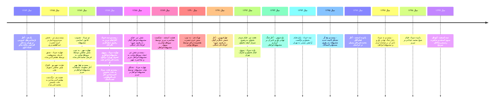

# گاه‌شمار انقلاب مشروطه
`این گاه‌شمار با کمک chatgpt ایجاد شده است. به همین دلیل کامل نبوده و و نیازمند ویرایش است.`

* با دوبار کلیک بر روی گاه‌شمار می‌توانید آن را بزرگنمایی کنید.

```mermaid
timeline
  سال ۱۲۸۴: یک دی - آغاز نارضایتی‌های عمومی در تهران به دلیل افزایش مالیات‌ها و فساد اداری
  سال ۱۲۸۵: بیست و دو تیر - تحصن مردم و روحانیان در حرم حضرت عبدالعظیم در ری
          : چهارده مرداد - صدور فرمان مشروطیت توسط مظفرالدین‌شاه
          : هجده شهریور - افتتاح اولین مجلس شورای ملی
          : هشت دی - درگذشت مظفرالدین‌شاه و به تخت نشستن محمدعلی‌شاه
  سال ۱۲۸۶: دو مرداد - تصویب قانون اساسی مشروطه
          : چهارده مهر - به توپ بستن مجلس توسط نیروهای دولتی به فرمان محمدعلی‌شاه
          : بیست و چهار مهر - آغاز مقاومت مسلحانه مشروطه‌خواهان در تبریز
  سال ۱۲۸۷: بیست و سه خرداد - آغاز قیام تبریز به رهبری ستارخان و باقرخان
          : دوازده مرداد - پیروزی مشروطه‌خواهان و تصرف تهران؛ برکناری محمدعلی‌شاه و تبعید او
          : بیست و هفت مرداد - به تخت نشستن احمدشاه و آغاز نایب‌السلطنتی عضدالملک
  سال ۱۲۸۸: شش تیر - قیام مشروطه‌خواهان گیلان به رهبری میرزا کوچک‌خان جنگلی
          : بیست و شش تیر - حمله نیروهای دولتی به مشروطه‌خواهان تبریز و محاصره شهر
          : چهارده مرداد - تشکیل دولت مشروطه توسط مشروطه‌خواهان در تبریز
  سال ۱۲۸۹: هشت اسفند - شکست محاصره تبریز توسط نیروهای دولتی و پیروزی مشروطه‌خواهان
  سال ۱۲۹۰: دوزاده دی - به توپ بستن حرم حضرت معصومه در قم توسط نیروهای دولتی
  سال ۱۲۹۱: چهار فروردین - آغاز جنبش جنگل در گیلان به رهبری میرزا کوچک‌خان جنگلی
  سال ۱۲۹۲: هفت تیر - قیام مردم بختیاری به رهبری سردار اسعد بختیاری
          : یازده مرداد - پیروزی قیام بختیاری و تصرف تهران
  سال ۱۲۹۳: یازده بهمن - آغاز جنگ جهانی اول و تاثیر آن بر ایران و مشروطه‌خواهان
  سال ۱۲۹۴: سه خرداد - پایان قیام بختیاری و بازگشت آرامش نسبی به تهران
  سال ۱۲۹۵: بیست و پنج آذر - تشکیل کابینه جدید مشروطه به رهبری مستوفی‌الممالک
  سال ۱۲۹۶: پانزده اسفند - آغاز قیام کلنل محمدتقی‌خان پسیان در خراسان
  سال ۱۲۹۷: بیست و نه مرداد - پایان جنگ جهانی اول و تاثیر آن بر اوضاع ایران و مشروطه‌خواهان
  سال ۱۲۹۸: پانزده مرداد - قیام شیخ محمد خیابانی در تبریز
  سال ۱۲۹۹: سه اسفند - کودتای سوم اسفند و به قدرت رسیدن رضاخان میرپنج
```