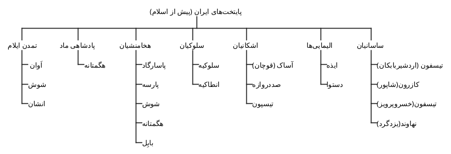
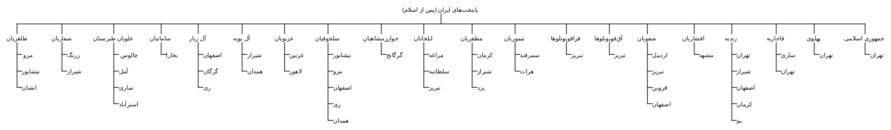

# پایتخت‌های ایران

* گاه‌شمار ایجاد شده براساس اطلاعات [ویکی‌پدیا فارسی](https://w.wiki/CA33) می‌باشد.

## پایتخت‌های ایران پیش از اسلام

```plantuml
@startwbs
*_ پایتخت‌های ایران (پیش از اسلام)
**_ تمدن ایلام 
***_ اَوان 
***_ شوش
***_ انشان
**_ پادشاهی ماد
***_ هگمتانه
**_ هخامنشیان
***_ پاسارگاد
***_ پارسه
***_ شوش
***_ هگمتانه
***_ بابِل
**_ سلوکیان
***_ سلوکیه
***_ انطاکیه
**_ اشکانیان
***_ آساک (قوچان)
***_ صددروازه
***_ تیسپون
**_ الیمایی‌ها
***_ ایذه
***_ دستوا
**_ ساسانیان
***_ تیسفون (اردشیربابکان)
***_ کازرون(شاپور)
***_ تیسفون(خسروپرویز)
***_ نهاوند(یزدگرد)
@endwbs
```

## پایتخت‌های ایران پس از اسلام

```plantuml
@startwbs
*_ پایتخت‌های ایران (پس از اسلام)
**_ طاهریان 
***_ مرو 
***_ نیشابور
***_ انشان
**_ صفاریان
***_ زرنگ
***_ شیراز
**_ علویان طبرستان
***_ چالوس 
***_ آمل
***_ ساری
***_ استرآباد
**_ سامانیان
***_ بخارا
**_ آل زیار
***_ اصفهان
***_ گرگان
***_ ری
**_ آل بویه
***_ شیراز
***_ همدان
**_ غزنویان
***_ غزنین
***_ لاهور
**_ سلجوقیان
***_ نیشابور
***_ مرو
***_ اصفهان
***_ ری
***_ همدان
**_ خوارزمشاهیان
***_ گرگانج
**_ ایلخانان
***_ مراغه
***_ سلطانیه
***_ تبریز
**_ مظفریان
***_ کرمان
***_ شیراز
***_ یزد
**_ تیموریان
***_ سمرقند
***_ هرات
**_ قراقویونلوها
***_ تبریز
**_ آق‌قویونلوها
***_ تبریز
**_ صفویان
***_ اردبیل
***_ تبریز
***_ قزوین
***_ اصفهان
**_ افشاریان
***_ مشهد
**_ زندیه
***_ تهران
***_ شیراز
***_ اصفهان
***_ کرمان
***_ بم
**_ قاجاریه
***_ ساری
***_ تهران
**_ پهلوی
***_ تهران
**_ جمهوری اسلامی
***_ تهران
@endwbs
```