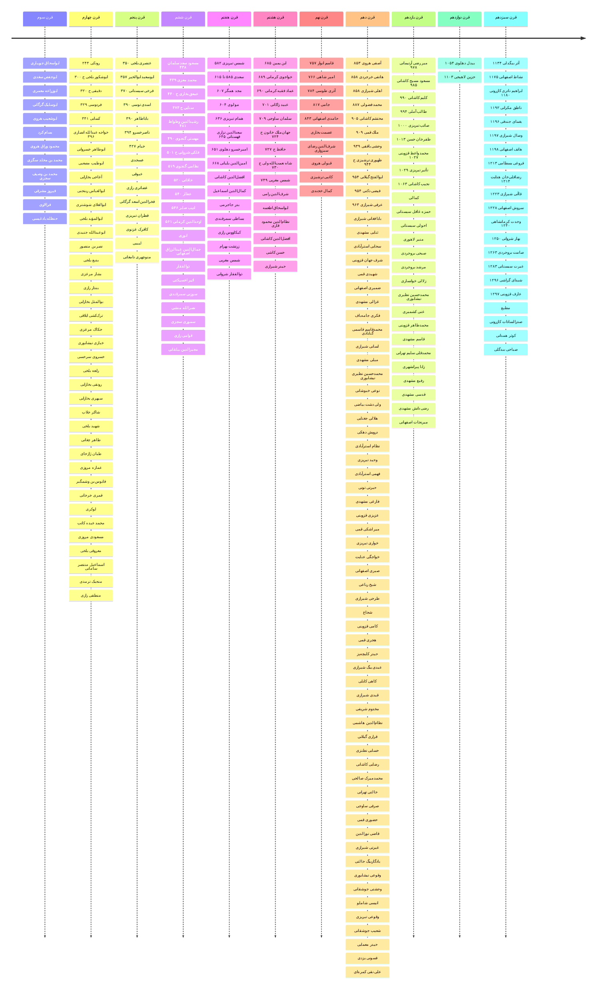

# گاه‌شمار شاعران ایران
در این جا تلاش شده است تا گاه‌شمار شاعران ایران نمایش داده شود.

* گاه‌شمارهای ایجاد شده براساس اطلاعات [ویکی‌پدیا فارسی](https://fa.wikipedia.org/wiki/%D9%81%D9%87%D8%B1%D8%B3%D8%AA_%D8%B4%D8%A7%D8%B9%D8%B1%D8%A7%D9%86_%D9%81%D8%A7%D8%B1%D8%B3%DB%8C%E2%80%8C%D8%B2%D8%A8%D8%A7%D9%86) می‌باشد.
* تاریخ‌های درج شده در گاه‌شمارها براساس **هجری قمری** می‌باشد.
* برای شاعرانی که تاریخ زادروز آن‌ها نامشخص است، تاریخ ثبت نشده است.
* شما می‌توانید با دوبار کلیک بر روی گاه‌شمار آن را بزرگنمایی کنید.

## گاه‌شمار کلی

## گاه‌شمار شاعران براساس قرن
با کلیک بر روی هر قرن می‌توانید شاعران  آن قرن را براساس سال تولد مشاهده کنید.

* با کلیک بر روی نام هر شاعر وارد صفحه ویکی‌پدیا آن شاعر خواهید شد.
* شاعرانی که نام آن‌ها با * مشخص شده است، تاریخ زادروز آن‌ها حدودی است.
* شاعرانی که تاریخ زادروز آن‌ها مشخص نیست، خارج از گاه‌شمار قرار گرفته‌اند.

[poets](_timeline/_poets/poets.html ':include height=400px')