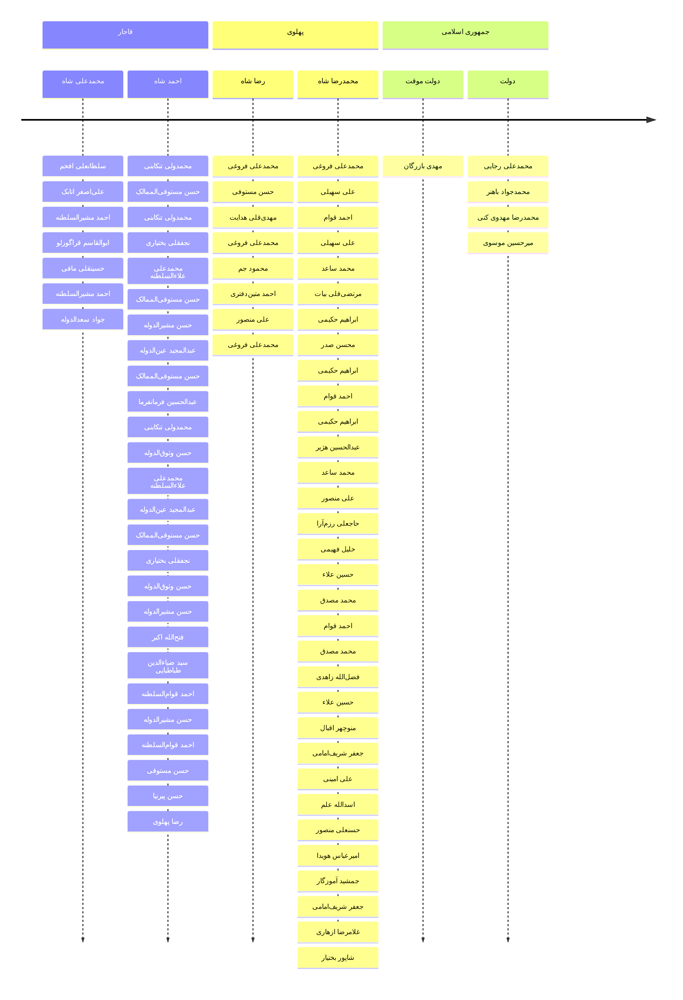

# نخست‌وزیران ایران

* گاه‌شمار ایجاد شده براساس اطلاعات [ویکی‌پدیا فارسی](https://w.wiki/BuoM) می‌باشد.

```mermaid
timeline
  section قاجار
    محمدعلی شاه: سلطانعلی افخم
            : علی‌اصغر اتابک
            : احمد مشیرالسلطنه
            : ابوالقاسم قراگوزلو
            : حسینقلی مافی
            : احمد مشیرالسلطنه
            : جواد سعدالدوله
    احمد شاه: محمدولی تنکابنی
            : حسن مستوفی‌الممالک
            : محمدولی تنکابنی
            : نجفقلی بختیاری
            : محمدعلی علاءالسلطنه
            : حسن مستوفی‌الممالک
            : حسن مشیرالدوله
            : عبدالمجید عین‌الدوله
            : حسن مستوفی‌الممالک
            : عبدالحسین فرمانفرما
            : محمدولی تنکابنی
            : حسن وثوق‌الدوله
            : محمدعلی علاءالسلطنه
            : عبدالمجید عین‌الدوله
            : حسن مستوفی‌الممالک
            : نجفقلی بختیاری
            : حسن وثوق‌الدوله
            : حسن مشیرالدوله
            : فتح‌الله اکبر
            : سید ضیاءالدین طباطبایی
            : احمد قوام‌السلطنه
            : حسن مشیرالدوله
            : احمد قوام‌السلطنه
            : حسن مستوفی
            : حسن پیرنیا
            : رضا پهلوی
  section پهلوی
    رضا شاه: محمدعلی فروغی
            : حسن مستوفی
            : مهدی‌قلی هدایت
            : محمدعلی فروغی
            : محمود جم
            : احمد متین‌دفتری
            : علی منصور
            : محمدعلی فروغی           
    محمدرضا شاه: محمدعلی فروغی
            : علی سهیلی
            : احمد قوام
            : علی سهیلی
            : محمد ساعد
            : مرتضی‌قلی بیات
            : ابراهیم حکیمی
            : محسن صدر
            : ابراهیم حکیمی
            : احمد قوام
            : ابراهیم حکیمی
            : عبدالحسین هژیر
            : محمد ساعد
            : علی منصور
            : حاجعلی رزم‌آرا
            : خلیل فهیمی
            : حسین علاء
            : محمد مصدق
            : احمد قوام
            : محمد مصدق
            : فضل‌الله زاهدی
            : حسین علاء
            : منوچهر اقبال
            : جعفر شریف‌امامی
            : علی امینی
            : اسدالله علم
            : حسنعلی منصور
            : امیرعباس هویدا
            : جمشید آموزگار
            : جعفر شریف‌امامی
            : غلامرضا ازهاری
            : شاپور بختیار
  section جمهوری اسلامی
    دولت موقت: مهدی بازرگان
    دولت: محمدعلی رجایی
            : محمدجواد باهنر
            : محمدرضا مهدوی کنی
            : میرحسین موسوی
```