# گاه‌شمار پادشاهی‌های ایران

* گاه‌شمار ایجاد شده براساس اطلاعات [ویکی‌پدیا فارسی](https://w.wiki/ALhg) می‌باشد.
* تاریخ‌های درج شده در گاه‌شمارها براساس **میلادی** می‌باشد.
* با کلیک بر روی لینک پادشاهان هر پادشاهی، می‌توانید گاه‌شمار آن پادشاهی را به همراه تاریخ بر تخت نشستن هر پادشاه را مشاهده کنید. 

[timelinejs](kingdomsTimeline/kingdoms.html ':include height=640px')

## گاه‌شمار کلی پادشاهی‌های ایران
* شما می‌توانید با دوبار کلیک بر روی گاه‌شمار آن را بزرگنمایی کنید.

```mermaid
timeline
  section پ.م ۲۸۰۰ - ۵۵۰
    ایلامیان
  section ۷۲۰ - ۵۵۰ پ.م 
    مادها
      : دیاکو (ن)
      : فرورتیش (ن)
      : هووخشتره (ن)
      : ایشتوویگو (ن)
  section ۵۵۰ - ۳۵۰ پ.م
    هخامنشیان
      : کوروش بزرگ ۵۵۹-۵۳۰
      : کمبوجیه ۵۳۰-۵۲۲
      : گئومات ۵۲۲-۵۲۲
      : داریوش بزرگ ۵۲۲-۴۸۶
      : خشایارشا ۴۸۶-۴۶۵
      : اردشیر یکم ۴۶۵-۴۲۴
      : خشایارشای دوم ۴۲۴-۴۲۴
      : سغدیانه ۴۲۴-۴۲۳
      : داریوش دوم ۴۲۴-۴۰۵
      : اردشیر دوم ۴۰۵-۳۵۸
      : اردشیر سوم ۳۵۸-۳۳۸
      : اردشیر چهارم ۳۳۸-۳۳۶
      : داریوش سوم ۳۳۶-۳۳۰
  section ۳۲۶ - ۲۵۶ پ.م
    سلوکیان
      : سلوکوس یکم ۳۱۲-۲۸۱
      : آنتیوخوس یکم ۲۸۱-۲۶۱
      : آنتیوخوس دوم ۲۶۱-۲۴۶
      : سلوکوس دوم ۲۴۶-۲۲۵
      : سلوکوس سوم ۲۲۵-۲۲۳
      : آنتیوخوس سوم ۲۲۳-۱۸۷
      : سلوکوس چهارم ۱۸۷-۱۷۵
      : آنتیوخوس چهارم ۱۷۵-۱۶۴
      : آنتیوخوس پنجم ۱۶۴-۱۶۲
      : دیمتریوس یکم ۱۶۲-۱۵۰
      : الکساندر یکم ۱۵۰-۱۴۵
      : آنتیوخوس ششم ۱۴۵-۱۴۲
      : دیمتریوس دوم ۱۴۵-۱۳۹
      : آنتیوخوس هفتم ۱۳۹-۱۲۹
      : دیمتریوس دوم (پادشاهی دوم) ۱۲۹-۱۲۵
      : الکساندر دوم ۱۲۸-۱۲۲
      : کلئوپاترای یکم ۱۲۵-۱۲۰
      : سلوکوس پنجم ۱۲۵
      : آنتیوخوس هشتم ۱۲۵-۹۶
      : آنتیوخوس نهم ۱۱۳-۹۵
      : سلوکوس ششم ۹۶-۹۵
      : دیمتریوس سوم ۹۵-۸۸
      : آنتیوخوس دهم ۹۵-۸۸
      : آنتیوخوس یازدهم ۹۵
      : فیلیپ یکم ۹۵-۸۳
      : آنتیوخوس دوازدهم ۸۵-۵۶
      : کلئوپاترای دوم ۸۳-۶۹
      : سلوکوس هفتم ۸۳-۵۸
      : آنتیوخوس سیزدهم ۶۴-۶۹
      : فیلیپ دوم سلوکی ۶۶-۶۳
  section ۲۴۸ پ.م - ۲۲۴
    اشکانیان
      : ارشک یکم ح ۲۵۰-ح ۲۴۸
      : تیرداد یکم ح ۲۴۷-ح ۲۱۴
      : اَردوان یکم ح ۲۱۴-ح ۱۹۶
      : فریاپت ح ۱۹-ح ۱۷۶
      : فرهاد یکم ح ۱۷۶-ح ۱۷۱
      : مهرداد یکم ح ۱۷۱-ح ۱۳۸
      : فرهاد دوم ح ۱۳۸-ح ۱۲۵
      : اردوان دوم ح ۱۲۸-۱۲۳
      : مهرداد دوم ح ۱۲۳-۹۱
      : گودرز یکم ح ۹۱-۷۸
      : ارد یکم ۷۸-؟ 
      : سیناتروک ح ۷۵-ح ۷۰
      : فرهاد سوم ح ۷۰-ح ۵۸
      : مهرداد سوم ح ۵۸-۵۶
      : ارد دوم ح ۵۶-ح ۳۷
      : فرهاد چهارم ح ۳۷-۲
      : تیرداد دوم ۳۲-ح ۳۰
      : فرهاد پنجم ۲ پ.م- ۴
      : ملکه موزا ۲ پ.م-۴
      : ارد سوم ۴-ح ۶
      : ونن یکم ح ۶-۱۲
      : اردوان سوم ۱۲-ح ۳۹
      : تیرداد سوم ح ۳۶
      : وردان ح ۳۹-۴۵
      : گودرز دوم ۴۱-۵۱
      : ونن دوم ۵۱
      : بلاش یکم ۵۱-ح ۷۷
      : پاکور دوم ح ۷۷-ح ۱۰۸
      : اردوان چهارم ۱۰۸-۱۱۰
      : خسرو ح ۱۱۰-ح ۱۲۸
      : بلاش دوم ۷۷-۸۰
      : مهرداد چهارم ح ۱۲۸-۱۴۷
      : بلاش سوم ح ۱۲۸-۱۴۷
      : بلاش چهارم ۱۴۷-۱۹۱
      : بلاش ششم ح ۲۱۶-۲۲۶
      : اردوان پنجم ۲۰۸-ح ۲۱۵
      : آرتاوازد  ح ۲۲۶-۲۲۷
      : تیرداد چهارم ح ۲۱۶-۲۲۴
  section ۲۲۶ - ۶۵۰
    ساسانیان
      : اردشیر بابکان ۲۲۴-۲۴۲
      : شاپور اردشیر ۴۲۰-۲۷۰
      : اورمزد شاپور ۲۷۰-۲۷۱
      : بهرام شاپور ۲۷۱-۲۷۴
      : بهرام بهرام ۲۷۶-۲۹۳
      : بهرام بهرامیان ۲۹۳
      : نرسی شاپور ۲۹۳-۳۰۳
      : اورمزد نرسی ۳۰۳ -۳۰۹
      : شاپور ذوالاکتاف ۳۰۹-۳۷۹
      : اردشیر نکوکار ۳۷۹-۳۸۳
      : شاپور شاپور ۳۸۳-۳۸۸
      : بهرام شاپور ۳۸۸-۳۹۹
      : یزدگرد بزه‌گر ۳۹۹-۴۲۰
      : بهرام گور ۴۰۲-۴۳۸
      : یزدگرد بهرام گور ۴۳۸-۴۵۷
      : هرمز بهرام گور ۴۵۷-۴۵۹
      : پیروز یزدگرد ۴۵۹-۴۸۴
      : بلاش پیروز ۴۸۴-۴۸۸
      : قباد پیروز ۴۸۸-۵۳۱
      : نوشین‌روان ۵۳۱-۵۷۹
      : هرمزد نوشین‌روان ۵۷۹-۵۹۰
      : خسرو پرویز ۵۹۰-۶۲۸
      : شیرویه ۶۲۸
      : اردشیر شیروی ۶۲۸-۶۲۹
      : فرآیین ۶۲۹
      : پوران‌دخت ۶۲۹-۶۳۰
      : آزرم‌دخت ۶۳۰-۶۳۱
      : فرخزاد خسرو ۶۳۱
      : یزدگرد شهریار ۶۳۲-۶۵۱
  section ۶۳۲ - ۶۶۱
    خلفای راشدین
      : ابوبکر ۶۳۲-۶۳۴
      : عمر ۶۳۴-۶۴۴
      : عثمان ۶۴۴-۶۵۶
      : علی ابن ای طالب ۶۵۶-۶۶۱
  section ۶۶۱ - ۷۵۰
    امویان
      : معاویه بن ابی سفیان ۶۶۱-۶۸۰
      : یزید بن معاویه ۶۸۰-۶۸۳
      : معاویه بن یزید ۶۸۳-۶۸۴
      : مروان بن حکم ۶۸۴-۶۸۵
      : عبدالملک بن مروان ۶۸۵-۷۰۵
      : ولید بن عبدالملک ۵۰۷-۷۱۵
      : سلیمان بن عبدالملک ۷۱۵-۷۱۷
      : عمر بن عبدالعزیز ۷۱۷-۷۲۰
      : یزید بن عبدالملک ۷۲۰-۷۲۴
      : هشام بن عبدالملک ۷۲۴-۷۴۳
      : ولید بن یزید ۷۴۳-۷۴۴
      : یزید بن ولید ۷۴۴
      : ابراهیم بن ولید ۷۴۴
      : مروان بن محمد ۷۴۴-۷۵۰
  section ۷۵۰ - ۸۳۳
    عباسیان
      : سفاح ۷۵۰-۷۵۴
      : منصور ۷۵۴-۷۷۵
      : مهدی ۷۷۵-۷۸۵
      : هادی ۷۸۵-۷۸۶
      : هارون الرشید ۷۸۶-۸۰۹
      : امین ۸۰۹-۸۱۳
      : مأمون ۸۱۳-۸۳۳
      : معتصم ۸۳۳-۸۴۲
  section ۸۲۱ - ۸۷۳
    طاهریان
      : طاهر بن حسین ۸۲۱-۸۲۲
      : طلحه بن طاهر ۸۲۲-۸۲۸
      : عبدالله بن طاهر ۸۲۸-۸۴۴
      : طاهر بن عبدالله ۸۴۴-۸۶۲
      : محمد بن طاهر ۸۶۴-۸۷۲
  section ۸۶۱ - ۱۰۰۲
    صفاریان
      : یعقوب لیث ۸۶۱-۸۷۹
      : عمرو لیث ۸۷۹-۹۰۱
      : طاهر بن محمد صفاری ۹۰۱-۹۰۸
      : لیث بن علی بن لیث ۹۰۸-۹۱۰
      : محمد بن علی لیث ۹۱۰-۹۱۱
      : المعدل بن علی ۹۱۱
      : عمرو بن یعقوب ۹۱۲-۹۱۳
      : احمد بن محمد بن خلف ۹۲۲-۹۶۳
      : خلف بن احمد ۹۶۳-۱۰۰۲
  section ۸۷۵ - ۹۹۹
    سامانیان
      : نصر یکم ۸۶۴-۸۹۲
      : اسماعیل یکم ۸۹۲-۹۰۷
      : احمد ۹۰۷-۹۱۴
      : نصر دوم ۹۱۴-۹۴۳
      : نوح یکم ۹۴۳-۹۵۴
      : عبدالملک یکم ۹۵۴-۹۶۱
      : منصور یکم ۹۶۱-۹۷۶
      : نوح دوم ۹۷۶-۹۹۷
      : منصور دوم ۹۹۷-۹۹۹
      : عبدالملک دوم ۹۹۹
      : اسماعیل منتصر ۱۰۰۰-۱۰۰۴
  section ۹۳۰ - ۱۰۹۰
    زیاریان
      : مرداویج زیاری ۹۳۰-۹۳۵
      : وشمگیر ۹۳۵-۹۶۷
      : بیستون پسر وشمگیر ۹۶۷-۹۷۷
      : قابوس پسر وشمگیر ۹۷۷-۱۰۱۲
      : منوچهر پسر قابوس ۱۰۱۲-۱۰۳۱
      : انوشیروان پسر منوچهر ۱۰۳۰-۱۰۵۰
  section ۹۳۴ - ۱۰۵۵
    آل بویه
      : ابوالحسن (فارس) ۹۳۴
      : عضدالدوله ابوشجاع (فارس) ۹۴۹
      : شرف‌الدوله ابوالفوارس (فارس) ۹۸۳
      : صمصام‌الدوله ابوکالیجار (فارس) ۹۸۹
      : بهاءالدوله ابونصر (فارس) ۹۹۸
      : سلطان‌الدوله ابوشجاع (فارس) ۱۰۱۲
      : عمادالدوله ابوکالیجار (فارس) ۱۰۲۴
      : ابومنصور (فارس) ۱۰۴۸
      : رکن‌الدوله ابوعلی (ری) ۹۳۵
      : فخرالدوله ابوالحسن (ری) ۹۷۶
      : مؤیدالدوله ابومنصور (ری) ۹۷۷
      : فخرالدوله (بار دوم) ابوالحسن (ری) ۹۸۴
      : مجدالدوله ابوطالب (ری) ۹۹۷
      : مؤیدالدوله ابومنصور (همدان) ۹۷۶
      : فخرالدوله ابوالحسن (همدان) ۹۸۴
      : شمس‌الدوله ابوطاهر (همدان) ۹۹۷
      : ابوالحسن (همدان) ۱۰۲۱
      : معزالدوله ابوالحسن (عراق) ۹۴۵
      : عزالدوله ابومنصور (عراق) ۹۶۷
      : عضدالدوله ابوشجاع (عراق) ۹۷۸
      : صمصام‌الدوله ابوکالیجار (عراق) ۹۸۳
      : شرف‌الدوله ابوالفوارس (عراق) ۹۸۷
      : بهاءالدوله ابونصر (عراق) ۹۸۹
      : ابوشجاع (عراق) ۱۰۱۲
      : مشرف‌الدوله ابوعلی ۱۰۲۱
      : جلال‌الدوله ابوطاهر ۱۰۲۷
      : عمادالدوله ابوکالیجار (عراق) ۱۰۴۴
      : مَلِکِ رحیم ابونصر (عراق)  ۱۰۴۸
  section ۹۶۳ - ۱۱۸۷
    غزنویان
      : سبکتگین ۹۷۷-۹۹۷
      : اسماعیل بن سبکتگین ۹۹۷-۹۹۸
      : سلطان محمود ۹۹۸-۱۰۳۰
      : سلطان محمد ۱۰۳۰
      : مسعود یکم ۱۰۳۰-۱۰۴۰
      : سلطان محمد ۱۰۴۰-۱۰۴۱
      : مودود ۱۰۴۰-۱۰۴۸
      : مسعود دوم ۱۰۴۸
      : علی ۱۰۴۸-۱۰۴۹
      : عبدالرشید ۱۰۴۹-۱۰۵۲
      : طغرل ۱۰۵۲-۱۰۵۳
      : فرخزاد ۱۰۵۳-۱۰۵۹
      : ابراهیم ۱۰۵۹-۱۰۹۹
      : مسعود ۱۰۹۹-۱۱۱۵
      : ارسلان‌شاه ۱۱۱۶-۱۱۱۷
      : بهرام‌شاه ۱۱۱۷-۱۱۵۲
      : خسروشاه ۱۱۶۸-۱۱۷۶
      : خسروملک ۱۱۶۰-۱۱۸۶
  section ۱۰۵۵ - ۱۱۹۴
    سلجوقیان
      : طغرل یکم ۱۰۳۷-۱۰۶۳
      : آلپ ارسلان ۱۰۶۳-۱۰۷۲
      : ملکشاه یکم ۱۰۷۲-۱۰۹۲
      : محمود یکم ۱۰۹۲-۱۰۹۴
      : برکیارق ۱۰۹۴-۱۱۰۵
      : ملکشاه دوم ۱۱۰۵
      : محمد یکم ۱۱۰۵-۱۱۱۸
      : احمد سنجر ۱۰۹۷-۱۱۱۸
      : محمود دوم ۱۱۱۸-۱۱۳۱
      : داود ۱۱۳۱-۱۱۳۲
      : طغرل دوم ۱۱۳۲-۱۱۳۴
      : مسعود ۱۱۳۴-۱۱۵۲
      : ملکشاه سوم ۱۱۵۲-۱۱۵۳
      : محمد دوم ۱۱۵۳-۱۱۶۰
      : سلیمانشاه ۱۱۶۰-۱۱۶۱
      : ارسلان ۱۱۶۱-۱۱۷۶
      : طغرل سوم ۱۱۷۶-۱۱۹۴
  section ۱۰۹۴ - ۱۲۲۱
    خوارزمشاهیان
      : قطب‌الدین محمد ۱۰۹۷-۱۱۲۷
      : علاءالدین اتسز ۱۱۲۷-۱۱۵۶
      : ایل‌ارسلان ۱۱۵۶-۱۱۷۲
      : علاءالدین تکش ۱۱۷۲-۱۲۰۰
      : محمود سلطان‌شاه ۱۱۷۲-۱۱۹۳
      : علاءالدین محمد ۱۲۰۰-۱۲۲۰
      : جلال‌الدین منکبرنی ۱۲۲۰-۱۲۳۱
  section ۱۲۵۶ - ۱۳۵۶
    ایلخانان
      : هولاکو خان ۱۲۵۶-۱۲۶۵
      : اباقا خان ۱۲۶۵-۱۲۸۲
      : احمد تگودار ۱۲۸۲-۱۲۸۴
      : ارغون‌خان ۱۲۸۴-۱۲۹۱
      : گیخاتو خان ۱۲۹۱-۱۲۹۵
      : بایدو ۱۲۹۵
      : غازان خان ۱۲۹۵-۱۳۰۴
      : محمد خدابنده ۱۳۰۴-۱۳۱۶
      : ابوسعید بهادرخان ۱۳۱۶-۱۳۳۵
      : آرپاکاوون ۱۳۳۵
      : موسی ۱۱۳۵-۱۱۳۶
      : پیرحسین ۱۳۳۵-۱۳۳۷
      : طغاتیمور ۱۳۳۶-۱۳۵۳
      : ساتی‌بیگ ۱۳۳۸
      : عزالدین ۱۳۳۸-۱۳۴۰
      : الیاس ۱۳۳۸-۱۳۴۷
      : سیف‌الملوک ۱۳۴۲
      : انوشیروان ۱۳۴۳-۱۳۵۶
      : غازان دوم ۱۳۵۶-۱۳۵۷
  section ۱۳۱۴ - ۱۳۹۳
    آل مظفر
      : مبارزالدین محمد ۱۳۱۴-۱۳۵۸
      : شاه محمود (اصفهان) ۱۳۵۸-۱۳۷۴
      : شاه شجاع ۱۳۵۸-۱۳۸۴
      : زین‌العابدین علی ۱۳۸۴-۱۳۸۷
      : عمادالدین احمد (کرمان) ۱۳۸۴-۱۳۹۳
      : شاه یحیی (یزد) ۱۳۸۴-۱۳۹۳
      : شاه منصور ۱۳۸۸-۱۳۹۳
  section ۱۳۷۰ - ۱۵۰۶
    تیموریان
      : تیمور ۱۳۳۶-۱۴۰۵
      : میرانشاه گورکانی ۱۴۰۵-۱۴۰۹
      : پیرمحمد جهانگیر ۱۴۰۵-۱۴۰۷
      : خلیل سلطان ۱۴۰۵-۱۴۰۹
      : شاهرخ ۱۴۰۵-۱۴۴۷
      : الغ‌بیگ ۱۴۴۷-۱۴۰۹
      : عبداللطیف میرزا ۱۴۴۹-۱۴۵۰
      : عبدالله میرزا۱۴۵۰-۱۴۵۱
      : سلطان محمد پسر بایسنقر ۱۴۴۷-۱۴۵۱
      : میرزا ابوالقاسم بابر ۱۴۵۱-۱۴۶۹
      : سلطان احمد میرزا ۱۴۶۹-۱۴۹۴
      : سلطان محمود میرزا ۱۴۹۴-۱۴۹۵
      : میرزا شاه محمود ۱۴۵۷
      : ابراهیم میرزا ۱۴۵۷-۱۴۵۹
      : ابوسعید گورکان ۱۴۵۱-۱۴۶۹
      : عمر شیخ میرزای دوم ۱۴۵۶-۱۴۹۴
      : یادگار محمد میرزا ۱۴۷۰
      : سلطان حسین بایقرا ۱۴۷۰-۱۵۰۶
      : بدیع‌الزمان میرزا ۱۵۰۶-۱۵۰۷
  section ۱۴۳۸ - ۱۵۰۳
    آق‌قویونلو و قراقویونلو
      : مظفرالدین جهان شاه ۱۴۳۸-۱۴۶۷
      : ابوالنصر سلطان اوزون حسن ۱۴۵۰۱۴۷۸
      : ابوالفتح سلطان خلیل ۱۴۷۸-۱۴۷۸
      : ابوالمظفر سلطان یعقوب ۱۴۷۸-۱۴۹۰
      : ابوالفتح سلطان بایسنقر ۱۴۹۰-۱۴۹۲
      : ابوالمظفر سلطان رستم ۱۴۹۲-۱۴۹۷
      : ابوالنصر سلطان احمد گوده ۱۴۹۷-۱۴۹۷
      : ابوالمکرم سلطان محمد ۱۴۹۷-۱۵۰۰
      : ابوالمظفر سلطان الوند ۱۴۹۸-۱۵۰۱
      : ابوالمظفر سلطان مراد ۱۵۰۰-۱۵۰۳
  section ۱۵۰۱ - ۱۷۲۲
    صفویان
      : اسماعیل یکم ۱۵۰۱-۱۵۲۴
      : تهماسب یکم ۱۵۲۴-۱۵۷۶
      : اسماعیل دوم ۱۵۷۶-۱۵۷۷
      : سلطان محمد ۱۵۷۸-۱۵۸۸
      : عباس یکم ۱۵۸۸-۱۶۲۹
      : صفی یکم ۱۶۲۹-۱۶۴۲
      : عباس دوم ۱۶۴۲-۱۶۶۶
      : سلیمان یکم ۱۶۶۶-۱۶۹۴
      : سلطان حسین ۱۶۹۴-۱۷۲۲
      : تهماسب دوم ۱۷۲۲-۱۷۳۳
      : عباس سوم ۱۷۳۲-۱۷۳۶
      : سلیمان دوم ۱۷۴۹-۱۷۵۰
      : اسماعیل سوم ۱۷۵۰-۱۷۷۳
  section ۱۷۲۲ - ۱۷۲۹
    هوتکیان
      : محمود افغان ۱۷۱۷-۱۷۲۵
      : اشرف افغان ۱۷۲۵-۱۷۳۰
  section ۱۷۳۶ - ۱۷۹۶
    افشاریان
      : نادرشاه ۱۷۳۶-۱۷۴۷
      : عادل‌شاه ۱۷۴۷-۱۷۴۸
      : ابراهیم‌شاه ۱۷۴۸-۱۷۴۹
      : شاهرخ‌شاه ۱۷۴۸-۱۷۹۶
  section ۱۷۵۱ - ۱۷۹۴
    زندیان
      : کریم‌خان زند ۱۷۵۱-۱۷۷۹
      : ابوالفتح‌خان زند ۱۷۷۹
      : محمدعلی‌خان زند ۱۷۷۹
      : صادق‌خان زند ۱۷۷۹-۱۷۸۱
      : علیمرادخان زند ۱۷۸۱-۱۷۸۵
      : جعفرخان زند ۱۷۸۵-۱۷۸۹
      : صیدمرادخان زند ۱۷۸۹
      : لطفعلی‌خان زند ۱۷۸۹-۱۷۹۴
  section ۱۷۸۹ - ۱۹۲۵
    قاجاریان
      : اقامحمدخان ۱۷۸۹-۱۷۹۷
      : فتحعلی‌شاه ۱۷۹۷-۱۸۳۴
      : محمدشاه ۱۸۳۴-۱۸۴۸
      : ناصرالدین‌شاه ۱۸۴۸-۱۸۹۶
      : مظفرالدین‌شاه ۱۸۹۶-۱۹۰۷
      : محمدعلی‌شاه ۱۹۰۷-۱۹۰۹
      : احمدشاه ۱۹۰۹-۱۹۲۵
  section ۱۹۲۵ - ۱۹۷۹
    پهلوی
      : رضاشاه ۱۹۲۵-۱۹۴۱
      : محمدرضاشاه ۱۹۴۱-۱۹۷۹
```

# گاه‌شمار پادشاهان اسطوره‌ای ایران
* گاه‌شمار ایجاد شده براساس اطلاعات [ویکی‌پدیا فارسی](https://w.wiki/AMPA) می‌باشد.
* در فراهم کردن این فهرست از شاهنامه‌ی فردوسی رونوشت جلال خالقی مطلق (شاهنامهٔ خالقی مطلق) استفاده شده‌است.
* محاسبه سال براساس نخستین روز بر تخت نشستن «کیومرث» می‌باشد.

<!-- [timelinejs](kingdoms/mythicalKings.html ':include height=640px') -->

...گاهشمار
- کیومرث
  :[[/kingdoms/kingdomsTimeline/pics/mythicalKings/keyumars.jpg]]
  :سال ۰ تا ۳۰ - دودمان پیشدادیان
  :کَیومَرْث یا گَیومَرْث، نام نخستین نمونه‌ی انسان در جهانشناسی مزدیسنا؛ نخستین پادشاه ایران و نخستین پادشاه پیشدادی در اسطوره‌شناسی ایرانی است، که برپایهٔ شاهنامهٔ فردوسی سی سال پادشاهی کرد. [ویکی‌پدیا](https://w.wiki/CHHu)
- هوشنگ
  :[[/kingdoms/kingdomsTimeline/pics/mythicalKings/hushang.jpg]]
  :سال ۳۰ تا ۷۰ - دودمان پیشدادیان
  :هوشَنْگ از پادشاهان پیشدادی است و در اوستا بند ۲۱ا از آبان‌یشت و در بند ۲۴ از رام‌یشت نام هوشنگ آمده‌است. وی نخستین شاهی بود که اهورامزدا آتش را به وی شناسانید. همچنین نخستین استخراج‌گر آهن، نخستین آهنگر و نخستین قربانی‌کننده است. [ویکی‌پدیا](https://w.wiki/CHHx)
- طهمورث
  :[[/kingdoms/kingdomsTimeline/pics/mythicalKings/tahmuras.jpg]]
  :سال ۷۰ تا ۱۰۰ - دودمان پیشدادیان
  :طَهْمورِث یا طَهْمورِتْ دیوبند از شخصیت‌های اساطیری ایرانی است. وی از پادشاهان دودمان پیشدادی و در شاهنامه پسر هوشنگ است. [ویکی‌پدیا](https://w.wiki/CHHz)
- جمشید
  :[[/kingdoms/kingdomsTimeline/pics/mythicalKings/jamshid.jpg]]
  :سال ۱۰۰ تا ۸۰۰ - دودمان پیشدادیان
  :جَم یا جَمشید یا یمه، یکی از پادشاهانِ اساطیری ایرانی است و قدمتی بس کهن دارد. نام او در اوستا و نوشتارهای پهلوی و نوشتارهای دوران اسلامی آمده‌ است. در اسطوره‌های ایرانی کارهایی سخت بزرگ به او نسبت داده شده‌ است. [ویکی‌پدیا](https://w.wiki/CHH$)
- ضحاک
  :[[/kingdoms/kingdomsTimeline/pics/mythicalKings/zahhak.jpg]]
  :سال ۸۰۰ تا ۱۸۰۰ - دودمان پیشدادیان
  :ضَحّاک یا اژدهاک، از پادشاهان افسانه‌ای ایران است. نام وی در اوستا به صورت اژی‌دَهاکَ آمده‌است و معنای آن، «مار اهریمنی» است. [ویکی‌پدیا](https://w.wiki/8PUQ)
- فریدون
  :[[/kingdoms/kingdomsTimeline/pics/mythicalKings/fereydun.jpg]]
  :سال ۱۸۰۰ تا ۲۳۰۰ - دودمان پیشدادیان
  :فِرِیدونْ یا آفریدونْ از برجسته‌ترین چهره‌های اسطوره‌ای ایران است. او پسر آبتین و فرانک و از تبار جمشید است که با یاری کاوه آهنگر بر ضحاک ستمگر، چیره شد و او را در کوه دماوند، زندانی کرد. [ویکی‌پدیا](https://w.wiki/CHJ3)
- منوچهر
  :[[/kingdoms/kingdomsTimeline/pics/mythicalKings/manuchehr.jpg]]
  :سال ۲۳۰۰ تا ۲۴۲۰ - دودمان پیشدادیان
  :مَنوچِهْرْ یکی از پادشاهان پیشدادی است. او از تبار فریدون است و به کین‌خواهی نیای خویش ایرج، سلم و تور را می‌کُشد. پس از آنکه منوچهر پادشاه پیشدادی توسط افراسیاب در تبرستان محاصره شد، بر سر صلح توافق کردند و منوچهر پیشنهاد داد که تورانیان زمینی به اندازه پرتاب یک تیر به او بازگردانند و افراسیاب نیز پذیرفت. [ویکی‌پدیا](https://w.wiki/CHJ4)
- نوذر
  :[[/kingdoms/kingdomsTimeline/pics/mythicalKings/nowzar.jpg]]
  :سال ۲۴۲۰ تا ۲۴۲۷ - دودمان پیشدادیان
  :نوذَرْ پسر منوچهر، یکی از شاهان پیشدادی در شاهنامه است. به دلیل بی‌تدبیری او ایران دچار وضعیت بحرانی شد. [ویکی‌پدیا](https://w.wiki/CHJ5)
- زَوْ
  :[[/kingdoms/kingdomsTimeline/pics/mythicalKings/zaav.jpg]]
  :سال ۲۴۲۷ تا ۲۴۳۲ - دودمان پیشدادیان
  :زَوْ یا زاب ، در شاهنامهٔ فردوسی پسر طهماسپ است. پس از آن‌که افراسیاب، نوذر را کشت؛ زَو به پادشاهی رسید. [ویکی‌پدیا](https://w.wiki/CHJ7)
- کی‌قباد
  :[[/kingdoms/kingdomsTimeline/pics/mythicalKings/kayKawad.jpg]]
  :سال ۲۴۳۲ تا ۲۵۳۲ - دودمان کیانیان
  :کَی‌قُباد در اسطوره‌شناسی ایرانی نخستین پادشاه و بنیان‌گذار دودمان کیانیان است. گویند این دودمان از او آغاز و تداوم می‌یابد. [ویکی‌پدیا](https://w.wiki/CHJ6)
- کی‌کاووس
  :[[/kingdoms/kingdomsTimeline/pics/mythicalKings/kayKavus.jpg]]
  :سال ۲۵۳۲ تا ۲۶۵۲ - دودمان کیانیان
  :کَی‌کاووسْ یا کَی‌کاوُسْ، در اوستا فرزند «کی‌اَپیوِه» است که او فرزند «کی‌قباد» است؛ ولی در شاهنامهٔ فردوسی و در روایت‌های پسین، کی‌کاووس را فرزند کی‌قباد دانسته‌اند. او یکی از پادشاهان نامدار کیانی است. [ویکی‌پدیا](https://w.wiki/CHJ8)
- کی‌خسرو
  :[[/kingdoms/kingdomsTimeline/pics/mythicalKings/kayKhosrow.jpg]]
  :سال ۲۶۵۲ تا ۲۷۱۲ - دودمان کیانیان
  :کَی‌خُسْرو در حماسه‌های ایرانی و شاهنامهٔ فردوسی، فرزند سیاوش و فرنگیس و نوادهٔ کی‌کاووس و افراسیاب است. واژه کی‌خسرو به معنی شاه نیک‌نام است. [ویکی‌پدیا](https://w.wiki/CHJ9)
- کی‌لهراسپ
  :[[/kingdoms/kingdomsTimeline/pics/mythicalKings/kayLohrasp.jpg]]
  :سال ۲۷۱۲ تا ۲۸۳۲ - دودمان کیانیان
  :کَی‌لُهْراسْپ در اساطیر ایران، از پادشاهان کیانی است. کی‌خسرو پیش از مرگ، او را به پادشاهی ایران برگزید. تفویض تاج و تخت به لهراسپ با اعتراض پهلوانان و بزرگان به‌ویژه زال روبه‌رو شد ولی بالاخره با دلایلی که کی‌خسرو آورد بر این انتخاب گردن نهادند. [ویکی‌پدیا](https://w.wiki/CHJA)
- کی‌گشتاسپ
  :[[/kingdoms/kingdomsTimeline/pics/mythicalKings/vishtaspa.jpg]]
  :سال ۲۸۳۲ تا ۲۹۵۲ - دودمان کیانیان
  :کَی‌گُشتاسْپ یا کَی‌ویشتاسْپ (به معنی دارنده اسب آماده) نام پادشاه ایران در زمان زرتشت است. زرتشت دین جدید را به گشتاسب عرضه کرد و گشتاسپ دین وی را پذیرفت و از وی پشتیبانی کرد. [ویکی‌پدیا](https://w.wiki/CHJB)
- کی‌بهمن
  :[[/kingdoms/kingdomsTimeline/pics/mythicalKings/kayBahman.jpg]]
  :سال ۲۹۵۲ تا ۳۰۱۲ - دودمان کیانیان
  :کَی‌بَهْمَنْ یا کَی‌اَردِشیرْ شناخته‌شده به درازدست (به‌دلیل چیره شدن وی بر سرزمین‌های دوردست)، پسر اسفندیار و پدر همای چهرزاد و داراب، پانزدهمین پادشاه ایران و ششمین پادشاه کیانی است که شصت سال پادشاهی کرد. [ویکی‌پدیا](https://w.wiki/CHJD)
- همای چهرزاد
  :[[/kingdoms/kingdomsTimeline/pics/mythicalKings/humayChehrzad.jpg]]
  :سال ۳۰۱۲ تا ۳۰۴۴ - دودمان کیانیان
  :هُمای شناخته‌شده به هُمای چِهْرْزاد، دختر کی‌بهمن و مادر داراب، شانزدهمین پادشاه ایران و هفتمین پادشاه کیانی است که بر پایهٔ شاهنامهٔ فردوسی و بهمن‌نامه وی سی و دو سال پادشاهی کرد ولی برپایهٔ بندهشن و دیگر منابع ایرانی-اسلامی وی سی سال پادشاهی کرد. [ویکی‌پدیا](https://w.wiki/CHJE)
- داراب
  :[[/kingdoms/kingdomsTimeline/pics/mythicalKings/daraI.jpg]]
  :سال ۳۰۴۴ تا ۳۰۵۶ - دودمان کیانیان
  :داراب یا دارا پسر کی‌بهمن و همای چهرزاد و پدر اسکندر و دارا، هفدهمین پادشاه ایران و هشتمین پادشاه کیانی است که دوازده سال پادشاهی کرد. [ویکی‌پدیا](https://w.wiki/CHJG)
- دارا
  :[[/kingdoms/kingdomsTimeline/pics/mythicalKings/dariusIII.jpg]]
  :سال ۳۰۶۵ تا ۳۰۷۰ - دودمان کیانیان
  :داریوش سوم یا دارا یا دارای دارایان، واپسین شاهنشاه هخامنشی در میانه ۳۳۶ تا ۳۳۰ پیش از میلاد بود. او فرزند آرشام (نوهٔ داریوش دوم) و سی‌سی‌گامبیس (دختر اردشیر دوم) بود. [ویکی‌پدیا](https://w.wiki/CHJH)
- اسکندر
  :[[/kingdoms/kingdomsTimeline/pics/mythicalKings/alexander.jpg]]
  :سال ۳۰۷۰ تا ۳۰۸۴ - دودمان کیانیان
  :اِسْکَنْدَر سوم مَقْدونی معروف به اسکندر بزرگ، اسکندر کبیر (به یونانی: Ἀλἑξανδρος ὁ Μἑγας) یا اسکندر ذوالقَرنِین پادشاه مقدونیه در یونان باستان بود. [ویکی‌پدیا](https://w.wiki/CHJJ)
...